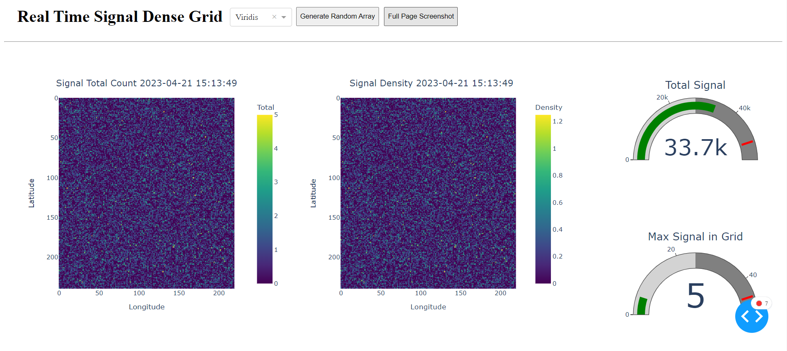

### GO_gis_server
    
- [x] Generate Massive Fake Data (2023/4/4)
- [x] GO calculate GIS Index (2023/4/8)
- [x] GO connect to Redis for cache and temporary storage
- [x] Construct Simple Web Page for Visualizations(time-line done)
- [x] Integrate GO server with DB and Web Page
- [ ] Optimize the speed of Dashboard (maybe ?)
- [ ] Correct the XY label name of Dashboard (maybe ?)
    
1. FINISH MULTI-PROCESSING GENERATE FAKE DATA in 9.81 min : 526 MB / 3,769,343 files in 120 folders    
2. Finish GIS GRID INDEX CALCULATION: Solve import modules in Test directory    
3. Calculate and Save binary data of batch_1 in 0.5 ~ 0.6 seconds    
4. Add simple redis connection: save simple Grid data for 10 seconds(local test)    
5. Finish All GIS GRID SUM save to redis(expire time is controlable now, now set to 10 sec)    
6. Construct simple dashboard by python ```dash plotly```, not integrated with GO server yet.    
7. SVG on the dashboard download from [svgrepo](https://www.svgrepo.com/)     
8. Finsh Intergrating with GO server and Redis cache (However, there's still some time knid of buggy:dizzy_face:)    

## More Details see word documentation in ```./report/```  :page_facing_up:	

## Redis-Server Commands :hugs:
```=
// RUN with cmd , not powershell
redis-server --service-start
redis-server --service-stop
// check connection
redis-cli ping
// version
redis-cli --version
```

:point_right: I use Redis for Windows version 5.0.14.1    

## Genrate Fake Data :bangbang:
:warning:Read Data_Generation_Warning.txt first before anything:warning:
```=
// run Generate_Fake_JSON_multiprocess.py to generate Fake Data
python Generate_Fake_JSON_multiprocess.py
```

## Save Directory :file_folder:   
```=
// Fake JSON - under multiple batch_x directory, x = 1 ~ 120
// run Generate_Fake_JSON_multiprocess.py to generate Fake Data
D:\Fake_Data\batch_x

// Grid Binary
D:\binary_grids\

// Screenshots
D:\GO_gis_server\test\Dashboard\Screenshots
```    

## Operation :signal_strength:
```=
// Open one powershell (PS), one normal CMD (CMD),one anaconda python prompt (AP)

// 1. Start Redis Server
CMD : cd C:\Program Files\Redis
CMD : redis-server --service-start
CMD : redis-cli ping

// 2. Go to the dashboard directory and start 
// use debug mode or not is up to you, debug mode has a much more clean prompt screen
AP : cd D:\GO_gis_server\test\Dashboard
AP : python dashboard.py

// 3. Go to the test directory and Start GO server
PS : go run .\Read_JSON.go
```    

Take a while, the dashboard will automatic update:repeat:  
<p align="center">
  
</p>  

<!-- INFO -->
:::info
This is my first try of GO language project, so I keep less third party modules
:::
<!-- END_INFO -->

## Creator

**GMfatcat** @ 2023/4/21

- <https://github.com/GMfatcat>
- <https://gmfatcat.github.io/website.io/>

## Copyright and license

Code released under the [MIT License](https://reponame/blob/master/LICENSE).  

Enjoy :metal:
